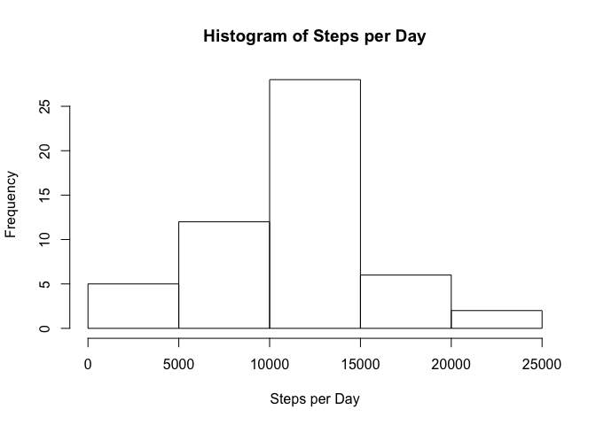
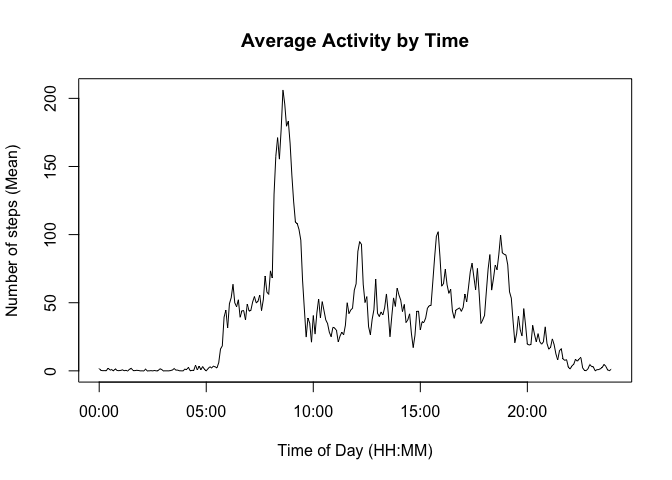
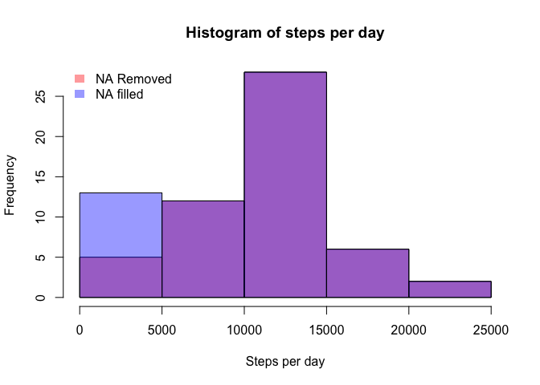
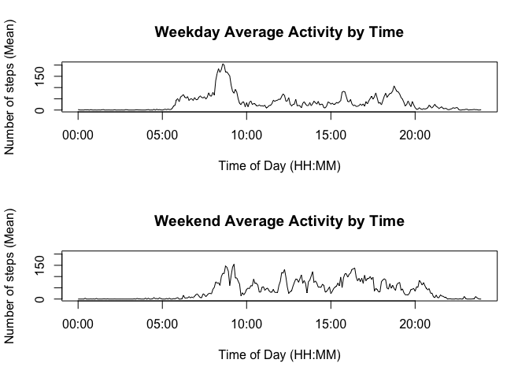

# Reproducible Research: Peer Assessment 1


The following dependencies exist for this report.

```r
library(data.table)
library(printr)
library(lubridate)
library(lattice)
```
## Loading and preprocessing the data

Read the data in from the files and save it into a data.table

```r
activity <- read.csv("activity.csv", na.strings = "NA")
activity.dt <- data.table(activity)
```

## What is the mean total number of steps taken per day

1. Calculate the total number of steps per day

```r
# remove the na lines
activity.dt.noNA <- na.omit(activity.dt)
# sum steps by date
activity.dt.steps.by.day <- activity.dt.noNA[,list(steps.total=sum(steps)),by=date]
```
Total steps by date:


date          steps.total
-----------  ------------
2012-10-02            126
2012-10-03          11352
2012-10-04          12116
2012-10-05          13294
2012-10-06          15420
2012-10-07          11015
2012-10-09          12811
2012-10-10           9900
2012-10-11          10304
2012-10-12          17382
2012-10-13          12426
2012-10-14          15098
2012-10-15          10139
2012-10-16          15084
2012-10-17          13452
2012-10-18          10056
2012-10-19          11829
2012-10-20          10395
2012-10-21           8821
2012-10-22          13460
2012-10-23           8918
2012-10-24           8355
2012-10-25           2492
2012-10-26           6778
2012-10-27          10119
2012-10-28          11458
2012-10-29           5018
2012-10-30           9819
2012-10-31          15414
2012-11-02          10600
2012-11-03          10571
2012-11-05          10439
2012-11-06           8334
2012-11-07          12883
2012-11-08           3219
2012-11-11          12608
2012-11-12          10765
2012-11-13           7336
2012-11-15             41
2012-11-16           5441
2012-11-17          14339
2012-11-18          15110
2012-11-19           8841
2012-11-20           4472
2012-11-21          12787
2012-11-22          20427
2012-11-23          21194
2012-11-24          14478
2012-11-25          11834
2012-11-26          11162
2012-11-27          13646
2012-11-28          10183
2012-11-29           7047

2. Histogram of step by day

 

3. Calculate the mean and the median of the total number of steps per day

```r
step.stats<-activity.dt.steps.by.day[,list(total.mean=mean(steps.total),total.median=median(steps.total))]
```
Step stats - mean: 10766.19,   median: 10765

## What is average daily activity pattern?

We want to see how much exercise people do on average during each time interval.

1. Make a time series plot (i.e. type = "l") of the 5-minute interval (x-axis) and the average number of steps taken, averaged across all days (y-axis)

```r
  # formatter to convert 815 to "08:15" and 2255 to "22:55"
intToHHMM <- function (i) {  sprintf("%02d:%02d", i %/% 100, i %% 100)}
# calculate the mean steps for each time interval
activity.dt.steps.by.interval.mean <- activity.dt.noNA[,list(steps.mean=mean(steps)),by=interval]
# add the column "interval.HHMM" which displays the interval as a string in the format HH:MM
activity.plot <- activity.dt.steps.by.interval.mean[, c("interval.HHMM") :=intToHHMM(interval), key="interval"]
# generate the plot
plot(strptime(activity.plot[, interval.HHMM], format="%H:%M"), activity.plot[, steps.mean],type="l", xlab="Time of Day (HH:MM)", ylab="Number of steps (Mean)", main="Average Activity by Time")
```

 


2.  Which 5-minute interval, on average across all the days in the dataset, contains the maximum number of steps?

```r
max.steps.row<-activity.plot[,.SD[which.max(steps.mean)]]
```
Interval 835 (08:35) has the average maximum number of steps: 206.1698113


## Imputing missing values

1. Calculate and report the total number of missing values in the dataset (i.e. the total number of rows with NAs)


```r
numMissing <- nrow(activity.dt) - nrow(activity.dt.noNA)
```
There were 2304 rows with missing values

2. Devise a strategy for filling in all of the missing values in the dataset. The strategy does not need to be sophisticated. For example, you could use the mean/median for that day, or the mean for that 5-minute interval, etc.

* Using the median value for the interval to fill in the missing data

3. Create a new dataset that is equal to the original dataset but with the missing data filled in.


```r
# for each interval with a missing reading use the mean for that interval as the value
#   Create a copy of dt with NAs (this is ineffiecient, but I do not want to lose things while experimenting)
activity.dt.filled <- activity.dt
#   Get medians for each interval
activity.dt.steps.by.interval.median <- activity.dt.noNA[,list(steps.median=median(steps)),by=interval]
#   replace steps with NA with the median.  This would be more efficent with get() calls.
activity.dt.filled$steps <- ifelse(is.na(activity.dt.filled$steps), activity.dt.steps.by.interval.median$steps.median[match(activity.dt.filled$interval,activity.dt.steps.by.interval.median$interval)], activity.dt.filled$steps)
```

4. Make a histogram of the total number of steps taken each day and Calculate and report the mean and median total number of steps taken per day. Do these values differ from the estimates from the first part of the assignment? What is the impact of imputing missing data on the estimates of the total daily number of steps?


```r
# sum filled steps by date
activity.dt.filled.steps.by.day <- activity.dt.filled[,list(steps.filled.total=sum(steps)),by=date]
# create comparison of daily steps without NAs and with NAs imputed
activity.dt.compare <- merge (activity.dt.steps.by.day, activity.dt.filled.steps.by.day, by='date',all=TRUE)
```
* Compare the total steps by date without NAs and with NAs filled:


date          steps.total   steps.filled.total
-----------  ------------  -------------------
2012-10-01             NA                 1141
2012-10-02            126                  126
2012-10-03          11352                11352
2012-10-04          12116                12116
2012-10-05          13294                13294
2012-10-06          15420                15420
2012-10-07          11015                11015
2012-10-08             NA                 1141
2012-10-09          12811                12811
2012-10-10           9900                 9900
2012-10-11          10304                10304
2012-10-12          17382                17382
2012-10-13          12426                12426
2012-10-14          15098                15098
2012-10-15          10139                10139
2012-10-16          15084                15084
2012-10-17          13452                13452
2012-10-18          10056                10056
2012-10-19          11829                11829
2012-10-20          10395                10395
2012-10-21           8821                 8821
2012-10-22          13460                13460
2012-10-23           8918                 8918
2012-10-24           8355                 8355
2012-10-25           2492                 2492
2012-10-26           6778                 6778
2012-10-27          10119                10119
2012-10-28          11458                11458
2012-10-29           5018                 5018
2012-10-30           9819                 9819
2012-10-31          15414                15414
2012-11-01             NA                 1141
2012-11-02          10600                10600
2012-11-03          10571                10571
2012-11-04             NA                 1141
2012-11-05          10439                10439
2012-11-06           8334                 8334
2012-11-07          12883                12883
2012-11-08           3219                 3219
2012-11-09             NA                 1141
2012-11-10             NA                 1141
2012-11-11          12608                12608
2012-11-12          10765                10765
2012-11-13           7336                 7336
2012-11-14             NA                 1141
2012-11-15             41                   41
2012-11-16           5441                 5441
2012-11-17          14339                14339
2012-11-18          15110                15110
2012-11-19           8841                 8841
2012-11-20           4472                 4472
2012-11-21          12787                12787
2012-11-22          20427                20427
2012-11-23          21194                21194
2012-11-24          14478                14478
2012-11-25          11834                11834
2012-11-26          11162                11162
2012-11-27          13646                13646
2012-11-28          10183                10183
2012-11-29           7047                 7047
2012-11-30             NA                 1141

**  As the table shows the effect is to fill in the and thus add low # of step rows to the data set.

* Histogram of step by day

 

  **  The histogram shows how the low step values have been shifted.


* Calculate the mean and the median of the total number of steps per day

```r
step.filled.stats<-activity.dt.filled.steps.by.day[,list(total.mean=mean(steps.filled.total),total.median=median(steps.filled.total))]
```
Step stats (with NAs) - mean: 10766.19,   median: 10765
Step stats (without NAs) - mean: 9503.869,   median: 10395

  **  The step stats (mean and median) show a downward shift in resulting from weighting the data at the low end of the step count.


## Are there differences in activity patterns between weekdays and weekends?

1. Create a new factor variable in the dataset with two levels – “weekday” and “weekend” indicating whether a given date is a weekday or weekend day.


```r
#   create new data.table, activity.dt.filled.DoW
activity.dt.filled.DoW <- activity.dt.filled
#   Add a column for the type of day ("Weekend", "Weekday")
activity.dt.filled.DoW$typeOfDay <- ifelse(wday(as.Date(activity.dt.filled$date)) ==1 | wday(as.Date(activity.dt.filled$date)) ==7  , "Weekend", "Weekday")
#   Make the column a factor
activity.dt.filled.DoW$typeOfDay <- as.factor(activity.dt.filled.DoW$typeOfDay)
```

2. Make a panel plot containing a time series plot (i.e. type = "l") of the 5-minute interval (x-axis) and the average number of steps taken, averaged across all weekday days or weekend days (y-axis). See the README file in the GitHub repository to see an example of what this plot should look like using simulated data.


```r
# calculate the mean steps for each time interval
activity.plot.DoW <- activity.dt.filled.DoW[,list(steps.mean=mean(steps)),by=c('interval', 'typeOfDay')]
#activity.dt.filled.DoW.steps.by.interval.mean
# add the column "interval.HHMM" which displays the interval as a string in the format HH:MM
activity.plot.DoW <- activity.plot.DoW[, c("interval.HHMM") :=intToHHMM(interval), key="interval"]
# plot by type of day to compare weeekday to weekend activities
#    get the max y values so we can use it to ensure the y ranges are the same.
steps.mean.max <- max(activity.plot.DoW$steps.mean)
#    plot one plot on top of the other
par(mfrow=c(2,1))
#    plot the Weekday
activity.plot.DoW.Weekday <- activity.plot.DoW[typeOfDay == "Weekday",]
plot(strptime(activity.plot.DoW.Weekday[, interval.HHMM], format="%H:%M"), activity.plot.DoW.Weekday[, steps.mean],type="l", xlab="Time of Day (HH:MM)", ylab="Number of steps (Mean)", ylim=c(0, steps.mean.max), main="Weekday Average Activity by Time")
#    plot the Weekend
activity.plot.DoW.Weekend <- activity.plot.DoW[typeOfDay == "Weekend",]
plot(strptime(activity.plot.DoW.Weekend[, interval.HHMM], format="%H:%M"), activity.plot.DoW.Weekend[, steps.mean],type="l", xlab="Time of Day (HH:MM)", ylab="Number of steps (Mean)", ylim=c(0, steps.mean.max), main="Weekend Average Activity by Time")
```

 

** The plots show that there is higher peek activity during weekdays and activity starts to build earlier.  On the weekend the 
activity starts later, but is higher throughout the middle of the day and continues later into the evening.   This is 
likely reflects that during weekdays people go to work in the morning and settle in for the day.  On weekends they get up later but
are active throughout the day and stay active later. 
